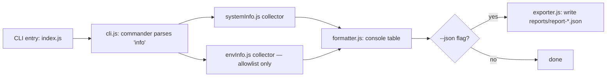

# virus-js — System Info & File CRUD Utility

> Thunder Hackathon 3.0 submission · theme: "Create a Virus in JS"

## 1. Project Overview

**This is not malware.** Despite the hackathon's provocative theme, this project is a legitimate, defensively-engineered Node.js CLI tool: it reports basic, harmless system information and lets the user perform file Create/Read/Update/Delete (CRUD) operations — but **only** inside a sandbox directory that the tool itself creates and controls.

Every design decision below exists specifically to demonstrate the difference between "a program that could be confused for a virus" and "a program that actually behaves like one." There is no networking, no process execution, no persistence/auto-run mechanism, no stealth, no raw environment dump, and every destructive action is gated behind confirmation and logged to an audit trail.

## 2. Objectives

- Collect and display system information and a small, explicit set of environment variables in a structured, readable format (console table + optional JSON export).
- Perform sandboxed file CRUD operations, never touching anything outside `./sandbox`.
- Never crash, regardless of missing data, bad input, or filesystem errors.
- Log every CRUD action (success or failure) to an audit log.
- Document the architecture and safety rationale clearly enough that a reviewer can verify the "not a virus" claim by reading the code.

## 3. Features

- `info` command: OS/CPU/memory/uptime summary + allowlisted environment variables, color-coded console tables.
- `crud create|read|update|delete` commands, all sandbox-validated.
- Path-traversal and absolute-path rejection (logged, not silently corrected).
- `--dry-run` on `update`/`delete` to preview effects with zero mutation.
- `--yes` flag to skip the interactive confirmation prompt for scripted/CI use; otherwise an interactive y/N prompt guards destructive actions.
- Append vs. overwrite modes for `update`.
- JSON-lines audit log (`sandbox/.audit.log`) for every CRUD attempt, including rejected ones.
- `--json` flag to export a full report to `reports/report-<timestamp>.json`.
- Defensive error handling throughout: every collector and every file operation is individually try/caught; a top-level `uncaughtException`/`unhandledRejection` safety net guarantees a clean exit instead of a crash.
- `dashboard` command: generates a static, self-contained HTML dashboard (`reports/dashboard.html`) summarizing system info, allowlisted env vars, and the full CRUD audit trail — light/dark theme follows OS preference automatically. No server, no networking; just a file written to disk.

## 4. Code Flow

**Info path:**



**CRUD path:**

```mermaid
flowchart LR
    A[CLI entry: index.js] --> B[cli.js: commander parses 'crud <op>']
    B --> C[sandbox.js: resolveSandboxPath]
    C -- escape attempt --> D[SandboxViolationError]
    D --> E[auditLogger.js: log rejected attempt]
    C -- valid path --> F{destructive op? update/delete}
    F -- yes, not --dry-run --> G[confirm via --yes or interactive prompt]
    F -- no / dry-run --> H[crud.js: perform fs operation]
    G -- confirmed --> H
    G -- not confirmed --> I[fail result, no mutation]
    H --> J[auditLogger.js: log outcome]
    I --> J
    J --> K[formatter.js: print result]
```

## 5. Strategy / Design Rationale

- **Sandbox-first architecture**: `sandbox.js` is the single chokepoint every path must pass through. No other module is allowed to build a filesystem path from user input directly — this makes the security property auditable in one file instead of scattered across the codebase.
- **Allowlist over blocklist**: rather than trying to block "bad" environment variable names, we only ever read a fixed, named list. This is strictly safer because it can't miss a future sensitive variable name.
- **Uniform result shape** (`{ success, error?, data? }`) from every CRUD function so the formatter and exporter don't need operation-specific branching, and so failures are data, not exceptions, at the call site.
- **Async I/O via `fs/promises`** throughout, avoiding blocking the event loop.
- **Graceful degradation everywhere**: every system-info field independently falls back to `"N/A"`; every env var independently falls back to `"not set"`. One platform quirk never sinks the whole report.
- **Audit log as the accountability layer**: because the tool can mutate files (even if only inside the sandbox), every attempt — successful, failed, or rejected for security reasons — is appended to `sandbox/.audit.log` as JSON lines, which is easy to grep, parse, or replay.

## 6. Folder Structure

```
virus-js/
├── src/
│   ├── system/
│   │   ├── systemInfo.js
│   │   └── envInfo.js
│   ├── fileOps/
│   │   ├── crud.js
│   │   └── sandbox.js        // path validation + sandbox root management
│   ├── output/
│   │   ├── formatter.js      // console table + chalk coloring
│   │   └── exporter.js       // JSON export to reports/
│   │   └── dashboard.js      // static HTML dashboard renderer
│   ├── audit/
│   │   └── auditLogger.js    // appends JSON-line entries to sandbox/.audit.log
│   └── cli.js                // commander setup, wires everything together
├── sandbox/                  // created at runtime; CRUD playground
├── reports/                  // created at runtime; JSON exports
├── index.js                  // entry point, requires src/cli.js
├── package.json
├── .gitignore
└── README.md
```

## 7. Modules/Packages Used

| Package | Purpose |
|---|---|
| `os` (built-in) | system info collection |
| `process` (built-in) | Node version, env vars, exit handling |
| `fs/promises` (built-in) | async file I/O |
| `path` (built-in) | path resolution & sandbox validation |
| `readline` (built-in) | interactive y/N confirmation prompt |
| `commander` | CLI argument parsing |
| `chalk` | console color coding |
| `cli-table3` | console table rendering |

## 8. Error Handling Strategy

- Every individual data-collection call (`os.cpus()`, `os.version()`, etc.) is wrapped in its own try/catch via a `safe()` helper in `systemInfo.js`, falling back to `"N/A"` rather than throwing.
- Every CRUD function catches filesystem errors and maps known codes (`ENOENT`, `EACCES`/`EPERM`, `EISDIR`, `EEXIST`) to friendly messages via `describeFsError()`, returning `{ success: false, error }` instead of throwing.
- Sandbox violations throw a dedicated `SandboxViolationError`, caught at the call site in `crud.js`, logged, and converted into the same uniform failure shape — so the CLI/formatter layer never has to special-case it.
- `index.js` installs `process.on('uncaughtException', ...)` and `process.on('unhandledRejection', ...)` as a final safety net, ensuring any truly unexpected error is logged to stderr and the process exits with code 1 instead of crashing with a raw stack trace.

## 9. Assumptions

- **Allowlist choice**: `PATH/Path`, `USER/USERNAME`, `HOME/USERPROFILE`, `SHELL`, `LANG`, `NODE_ENV` were chosen as informational, low-sensitivity variables common across Unix and Windows. No credentials, tokens, or API keys are ever in scope.
- **Sandbox scope**: the sandbox root is a single fixed directory (`./sandbox`) created next to the project, not configurable via CLI flags or environment variables — this prevents a user (or injected input) from redirecting the sandbox elsewhere.
- **CRUD definition**: "Create" fails if the file already exists (use `update --append`/overwrite for existing files), to avoid silent data loss by default.

## 10. ⚠️ Safety & Ethics

This tool was built under hard, non-negotiable constraints specifically to avoid crossing from "themed hackathon project" into "actual malware":

- **Sandboxed file access only.** Every path is resolved with `path.resolve()` and checked against the sandbox root; `..` traversal and absolute paths are rejected outright, never "corrected."
- **No raw environment dump.** Only a fixed, explicit allowlist of variables is ever read — `process.env` is never enumerated as a whole.
- **No networking code.** No `http`, `https`, `net`, `dgram`, `fetch`, or any outbound request anywhere in this codebase.
- **No process execution.** No `child_process`, `exec`, `spawn`, or shelling out.
- **No persistence mechanisms.** Nothing writes to startup folders, cron, systemd, the registry, or shell rc files. The tool only ever runs when explicitly invoked.
- **No stealth or evasion.** No hidden processes, no disguised filenames, no suppressed output, no anti-debugging.
- **Confirmation + dry-run on destructive operations.** `update` and `delete` require either an interactive y/N confirmation or an explicit `--yes` flag, and both support `--dry-run` to preview without mutating anything.
- **Full audit logging.** Every CRUD attempt — including rejected sandbox-escape attempts — is appended to `sandbox/.audit.log` as a timestamped JSON line.

## 11. Sample Output

### Console output (`node index.js info`)

```
Sandbox root: /home/claude/virus-js/sandbox

──────────────────────
  System Information
──────────────────────
┌─────────────────┬───────────────────────────────────────┐
│ Field           │ Value                                 │
├─────────────────┼───────────────────────────────────────┤
│ OS Type         │ Linux                                 │
├─────────────────┼───────────────────────────────────────┤
│ OS Release      │ 6.18.5                                │
├─────────────────┼───────────────────────────────────────┤
│ OS Version      │ #1 SMP PREEMPT_DYNAMIC @0              │
├─────────────────┼───────────────────────────────────────┤
│ Platform        │ linux                                 │
├─────────────────┼───────────────────────────────────────┤
│ Architecture    │ x64                                   │
├─────────────────┼───────────────────────────────────────┤
│ CPU Model       │ Intel(R) Xeon(R) Processor @ 2.80GHz  │
├─────────────────┼───────────────────────────────────────┤
│ CPU Cores       │ 1                                     │
├─────────────────┼───────────────────────────────────────┤
│ Hostname        │ vm                                    │
├─────────────────┼───────────────────────────────────────┤
│ Node.js Version │ v22.22.2                              │
├─────────────────┼───────────────────────────────────────┤
│ Home Directory  │ /root                                 │
├─────────────────┼───────────────────────────────────────┤
│ Uptime          │ 0d 0h 2m                              │
├─────────────────┼───────────────────────────────────────┤
│ Total Memory    │ 3.90 GB                               │
├─────────────────┼───────────────────────────────────────┤
│ Free Memory     │ 3.64 GB                               │
└─────────────────┴───────────────────────────────────────┘

─────────────────────────────────────
  Allowlisted Environment Variables
─────────────────────────────────────
  (Only an explicit allowlist is read -- never a full process.env dump. See README.)
┌─────────────┬─────────────────────────────────────────────────────────┐
│ Variable    │ Value                                                  │
├─────────────┼─────────────────────────────────────────────────────────┤
│ PATH        │ /usr/local/sbin:/usr/local/bin:/usr/sbin:/usr/bin:/bin │
├─────────────┼─────────────────────────────────────────────────────────┤
│ Path        │ not set                                                │
├─────────────┼─────────────────────────────────────────────────────────┤
│ USER        │ not set                                                │
├─────────────┼─────────────────────────────────────────────────────────┤
│ USERNAME    │ not set                                                │
├─────────────┼─────────────────────────────────────────────────────────┤
│ HOME        │ /root                                                  │
├─────────────┼─────────────────────────────────────────────────────────┤
│ USERPROFILE │ not set                                                │
├─────────────┼─────────────────────────────────────────────────────────┤
│ SHELL       │ not set                                                │
├─────────────┼─────────────────────────────────────────────────────────┤
│ LANG        │ not set                                                │
├─────────────┼─────────────────────────────────────────────────────────┤
│ NODE_ENV    │ not set                                                │
└─────────────┴─────────────────────────────────────────────────────────┘
```

### CRUD + sandbox rejection (real run)

```
$ node index.js crud read "../../etc/passwd"

───────────────────────────────
  CRUD Operation Result: READ
───────────────────────────────
┌─────────┬─────────────────────────────────────────────┐
│ Field   │ Value                                       │
├─────────┼─────────────────────────────────────────────┤
│ Target  │ ../../etc/passwd                            │
├─────────┼─────────────────────────────────────────────┤
│ Success │ false                                       │
├─────────┼─────────────────────────────────────────────┤
│ Error   │ Rejected: ".." path traversal is not allowed.│
└─────────┴─────────────────────────────────────────────┘
```

## 11a. Dashboard Output (`node index.js dashboard`)

Writes `reports/dashboard.html` — a single static file with no external requests, derived entirely from data already collected in-process (same `systemInfo`/`envInfo` collectors, plus `readAuditLog()`). Sections:

- **Stat strip**: OS, platform, CPU, memory, uptime
- **Environment panel**: allowlisted env vars
- **Audit summary**: total/succeeded/failed/rejected counts + per-action breakdown
- **Audit log timeline**: every CRUD attempt with a status indicator (ok / blocked / failed), timestamp, target path, and detail

Color scheme follows `prefers-color-scheme` (light/dark), no JS-based theme toggle or stored preference needed.

### Audit log (`sandbox/.audit.log`, real run, JSON lines)

```json
{"timestamp":"2026-06-21T08:31:57.940Z","action":"create","path":"./test.txt","success":true,"detail":null}
{"timestamp":"2026-06-21T08:32:01.635Z","action":"read","path":"./test.txt","success":true,"detail":null}
{"timestamp":"2026-06-21T08:32:05.147Z","action":"read","path":null,"success":false,"detail":"Rejected: \"..\" path traversal is not allowed."}
{"timestamp":"2026-06-21T08:32:05.229Z","action":"create","path":null,"success":false,"detail":"Rejected: absolute paths are not allowed. Provide a path relative to the sandbox."}
{"timestamp":"2026-06-21T08:32:10.307Z","action":"update","path":"./test.txt","success":true,"detail":"[dry-run] Would append to this file."}
{"timestamp":"2026-06-21T08:32:10.387Z","action":"update","path":"./test.txt","success":true,"detail":"mode=append"}
{"timestamp":"2026-06-21T08:32:10.463Z","action":"delete","path":"./test.txt","success":true,"detail":"[dry-run] Would delete this file."}
```

### JSON report export (`reports/report-<timestamp>.json`, real run, truncated)

```json
{
  "generatedAt": "2026-06-21T08:32:10.557Z",
  "systemInfo": {
    "osType": "Linux",
    "osRelease": "6.18.5",
    "platform": "linux",
    "arch": "x64",
    "cpuModel": "Intel(R) Xeon(R) Processor @ 2.80GHz",
    "cpuCores": 1,
    "hostname": "vm",
    "nodeVersion": "v22.22.2",
    "homeDir": "/root",
    "uptime": "0d 0h 3m",
    "totalMemory": "3.90 GB",
    "freeMemory": "3.63 GB"
  },
  "envInfo": {
    "PATH": "/usr/local/sbin:/usr/local/bin:/usr/sbin:/usr/bin:/bin",
    "HOME": "/root",
    "NODE_ENV": "not set"
  }
}
```

## 12. How to Run

```bash
# install dependencies
npm install

# show system info + allowlisted env vars
node index.js info

# also export a JSON report
node index.js --json info

# create a file in the sandbox
node index.js crud create notes.txt --content "hello sandbox"

# read it back
node index.js crud read notes.txt

# update it (interactive confirmation, or --yes to skip)
node index.js crud update notes.txt --content "more text" --append --yes

# preview a delete without doing it
node index.js crud delete notes.txt --dry-run

# actually delete it
node index.js crud delete notes.txt --yes

# generate a visual HTML dashboard (system info + env vars + audit log)
node index.js dashboard
# then open reports/dashboard.html in a browser
```

## 13. Future Improvements

- Plugin-style collectors so new system-info sections can be registered without touching `cli.js`.
- Automated test suite (e.g. `node:test` or `vitest`) covering sandbox-escape edge cases, confirmation gating, and graceful-fallback paths.
- Packaged single binary (e.g. via `pkg` or Node's built-in SEA) for distribution without requiring `npm install`.
