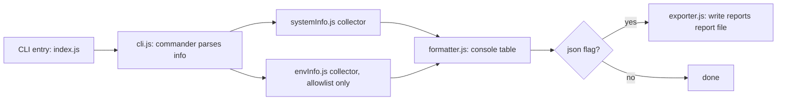
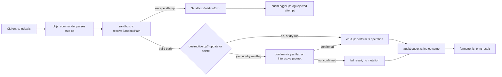

# virus-js — System Info & File CRUD Utility

> Thunder Hackathon 3.0 submission · theme: "Create a Virus in JS"

## 1. Project Overview

**This is not malware, I promise.** The hackathon theme was basically daring people to write something sketchy, so I went the other way: virus-js is a CLI tool that reports basic system info and lets you do file CRUD (create/read/update/delete) — but only inside a sandbox folder it creates and controls itself.

Every choice in this project is there to show the gap between "code that *looks* like it could be a virus" and "code that actually *acts* like one." No networking, no spawning processes, nothing that persists or auto-runs, no hiding what it's doing, no dumping your whole environment — and anything destructive needs confirmation and gets logged.

## 2. Objectives

- Show system info and a small, named set of env variables in a readable way (table in the console, or export it as JSON).
- Let you do file CRUD, but never let it touch anything outside `./sandbox`.
- Don't crash. Ever. Even with weird input or filesystem errors.
- Log every CRUD action, whether it worked or not.
- Make the safety reasoning clear enough that someone could read the code and actually verify "yeah, this isn't malware."

## 3. Features

- `info` command — OS/CPU/memory/uptime, plus allowlisted env vars, color-coded in the console.
- `crud create|read|update|delete` — all sandbox-checked.
- Path traversal and absolute paths get flat-out rejected (and logged) — never silently "fixed."
- `--dry-run` on `update`/`delete` so you can preview what would happen without it actually happening.
- `--yes` to skip the confirmation prompt (handy for scripts/CI); otherwise you get an interactive y/N before anything destructive runs.
- `update` can append or overwrite.
- Every CRUD attempt — success, fail, or rejected — gets written to `sandbox/.audit.log` as JSON lines.
- `--json` flag dumps a full report to `reports/report-<timestamp>.json`.
- Defensive error handling everywhere — every collector and file op is wrapped in its own try/catch, plus a top-level safety net (`uncaughtException`/`unhandledRejection`) so nothing ever crashes with a raw stack trace.
- `dashboard` command — spits out a clean static HTML dashboard (`reports/dashboard.html`) with system info, env vars, and the full audit trail. Light/dark follows your OS automatically. Still just a file on disk — no server, no networking.

## 4. Code Flow

**Info path:**



**CRUD path:**



## 5. Strategy / Why I Built It This Way

- **One chokepoint for paths**: `sandbox.js` is the only place allowed to turn user input into an actual filesystem path. Nothing else builds a path directly — so the whole security story lives in one file instead of being scattered everywhere.
- **Allowlist, not blocklist**: instead of trying to guess which env vars are "dangerous," I just only ever read a fixed list of harmless ones. Way safer — you can't accidentally miss a sensitive var you didn't think of.
- **Every CRUD function returns the same shape** (`{ success, error?, data? }`), so the formatter/exporter don't need special cases per operation, and failures are just data instead of thrown exceptions.
- **Everything's async** (`fs/promises`), so nothing blocks the event loop.
- **Stuff degrades gracefully**: if one system-info field fails to read, it just shows `"N/A"` instead of taking down the whole report. Same with env vars → `"not set"`.
- **Audit log = accountability**: since this thing can mutate files (even sandboxed ones), every single attempt gets appended to `sandbox/.audit.log` as JSON lines — easy to grep, parse, replay, whatever.

## 6. Folder Structure

```
virus-js/
├── src/
│   ├── system/
│   │   ├── systemInfo.js
│   │   └── envInfo.js
│   ├── fileOps/
│   │   ├── crud.js
│   │   └── sandbox.js        // path validation + sandbox root management
│   ├── output/
│   │   ├── formatter.js      // console table + chalk coloring
│   │   ├── exporter.js       // JSON export to reports/
│   │   └── dashboard.js      // static HTML dashboard renderer
│   ├── audit/
│   │   └── auditLogger.js    // appends JSON-line entries to sandbox/.audit.log
│   └── cli.js                // commander setup, wires everything together
├── sandbox/                  // created at runtime; CRUD playground
├── reports/                  // created at runtime; JSON exports + dashboard.html
├── index.js                  // entry point, requires src/cli.js
├── package.json
├── .gitignore
└── README.md
```

## 7. Modules/Packages Used

| Package | Purpose |
|---|---|
| `os` (built-in) | system info collection |
| `process` (built-in) | Node version, env vars, exit handling |
| `fs/promises` (built-in) | async file I/O |
| `path` (built-in) | path resolution & sandbox validation |
| `readline` (built-in) | interactive y/N confirmation prompt |
| `commander` | CLI argument parsing |
| `chalk` | console color coding |
| `cli-table3` | console table rendering |

## 8. Error Handling

- Every individual system call (`os.cpus()`, `os.version()`, etc.) is wrapped in its own try/catch via a small `safe()` helper, falling back to `"N/A"` instead of blowing up.
- Every CRUD function catches filesystem errors and turns known codes (`ENOENT`, `EACCES`/`EPERM`, `EISDIR`, `EEXIST`) into friendly messages instead of raw error dumps.
- Sandbox violations throw a custom `SandboxViolationError`, caught right where it happens, logged, and turned into the same uniform failure shape — so nothing downstream has to special-case it.
- `index.js` sets up `uncaughtException`/`unhandledRejection` handlers as a last resort, so anything truly unexpected gets logged to stderr and exits cleanly with code 1 instead of dumping a stack trace.

## 9. Assumptions I Made

- **Env allowlist**: picked `PATH/Path`, `USER/USERNAME`, `HOME/USERPROFILE`, `SHELL`, `LANG`, `NODE_ENV` since they're harmless and informational across both Unix and Windows. No creds, tokens, or API keys anywhere near this.
- **Sandbox is fixed**: the sandbox root is always `./sandbox`, not configurable via flags or env vars — on purpose, so nobody (or nothing) can redirect it somewhere it shouldn't be.
- **`create` fails if the file already exists** — use `update` (append or overwrite) for existing files. Didn't want silent overwrites by default.

## 10. Safety & Ethics

Built this under some pretty strict self-imposed rules, specifically so it doesn't accidentally cross from "themed hackathon joke" into "actual malware":

- **Sandboxed file access only.** Every path goes through `path.resolve()` and gets checked against the sandbox root. `..` and absolute paths get rejected outright — never quietly "fixed."
- **No raw env dump.** Only a fixed, explicit list of vars gets read. `process.env` never gets enumerated as a whole.
- **No networking, period.** No `http`, `https`, `net`, `dgram`, `fetch` — nothing that reaches outside the machine.
- **No process execution.** No `child_process`, `exec`, `spawn`, no shelling out to anything.
- **No persistence.** Nothing touches startup folders, cron, systemd, the registry, shell rc files. It only ever runs when you explicitly run it.
- **No stealth.** No hidden processes, no disguised filenames, no suppressed output, no anti-debugging tricks.
- **Confirmation + dry-run on anything destructive.** `update` and `delete` need either an interactive yes or an explicit `--yes`, and both support `--dry-run` so you can preview first.
- **Everything's logged.** Every CRUD attempt — including blocked sandbox-escape attempts — gets a timestamped line in the audit log.

## 11. Sample Output

### Console output (`node index.js info`)

```
Sandbox root: /home/claude/virus-js/sandbox

──────────────────────
  System Information
──────────────────────
┌─────────────────┬───────────────────────────────────────┐
│ Field           │ Value                                 │
├─────────────────┼───────────────────────────────────────┤
│ OS Type         │ Linux                                 │
├─────────────────┼───────────────────────────────────────┤
│ OS Release      │ 6.18.5                                │
├─────────────────┼───────────────────────────────────────┤
│ OS Version      │ #1 SMP PREEMPT_DYNAMIC @0             │
├─────────────────┼───────────────────────────────────────┤
│ Platform        │ linux                                 │
├─────────────────┼───────────────────────────────────────┤
│ Architecture    │ x64                                   │
├─────────────────┼───────────────────────────────────────┤
│ CPU Model       │ Intel(R) Xeon(R) Processor @ 2.80GHz  │
├─────────────────┼───────────────────────────────────────┤
│ CPU Cores       │ 1                                     │
├─────────────────┼───────────────────────────────────────┤
│ Hostname        │ vm                                    │
├─────────────────┼───────────────────────────────────────┤
│ Node.js Version │ v22.22.2                              │
├─────────────────┼───────────────────────────────────────┤
│ Home Directory  │ /root                                 │
├─────────────────┼───────────────────────────────────────┤
│ Uptime          │ 0d 0h 2m                              │
├─────────────────┼───────────────────────────────────────┤
│ Total Memory    │ 3.90 GB                               │
├─────────────────┼───────────────────────────────────────┤
│ Free Memory     │ 3.64 GB                               │
└─────────────────┴───────────────────────────────────────┘

─────────────────────────────────────
  Allowlisted Environment Variables
─────────────────────────────────────
  (Only an explicit allowlist is read -- never a full process.env dump. See README.)
┌─────────────┬─────────────────────────────────────────────────────────┐
│ Variable    │ Value                                                   │
├─────────────┼─────────────────────────────────────────────────────────┤
│ PATH        │ /usr/local/sbin:/usr/local/bin:/usr/sbin:/usr/bin:/bin  │
├─────────────┼─────────────────────────────────────────────────────────┤
│ Path        │ not set                                                 │
├─────────────┼─────────────────────────────────────────────────────────┤
│ USER        │ not set                                                 │
├─────────────┼─────────────────────────────────────────────────────────┤
│ USERNAME    │ not set                                                 │
├─────────────┼─────────────────────────────────────────────────────────┤
│ HOME        │ /root                                                   │
├─────────────┼─────────────────────────────────────────────────────────┤
│ USERPROFILE │ not set                                                 │
├─────────────┼─────────────────────────────────────────────────────────┤
│ SHELL       │ not set                                                 │
├─────────────┼─────────────────────────────────────────────────────────┤
│ LANG        │ not set                                                 │
├─────────────┼─────────────────────────────────────────────────────────┤
│ NODE_ENV    │ not set                                                 │
└─────────────┴─────────────────────────────────────────────────────────┘
```

### CRUD + sandbox rejection (real run)

```
$ node index.js crud read "../../etc/passwd"

───────────────────────────────
  CRUD Operation Result: READ
───────────────────────────────
┌─────────┬─────────────────────────────────────────────┐
│ Field   │ Value                                       │
├─────────┼─────────────────────────────────────────────┤
│ Target  │ ../../etc/passwd                            │
├─────────┼─────────────────────────────────────────────┤
│ Success │ false                                       │
├─────────┼─────────────────────────────────────────────┤
│ Error   │ Rejected: ".." path traversal is not allowed│
└─────────┴─────────────────────────────────────────────┘
```

### Audit log (`sandbox/.audit.log`, real run, JSON lines)

```json
{"timestamp":"2026-06-21T08:31:57.940Z","action":"create","path":"./test.txt","success":true,"detail":null}
{"timestamp":"2026-06-21T08:32:01.635Z","action":"read","path":"./test.txt","success":true,"detail":null}
{"timestamp":"2026-06-21T08:32:05.147Z","action":"read","path":null,"success":false,"detail":"Rejected: \"..\" path traversal is not allowed."}
{"timestamp":"2026-06-21T08:32:05.229Z","action":"create","path":null,"success":false,"detail":"Rejected: absolute paths are not allowed. Provide a path relative to the sandbox."}
{"timestamp":"2026-06-21T08:32:10.307Z","action":"update","path":"./test.txt","success":true,"detail":"[dry-run] Would append to this file."}
{"timestamp":"2026-06-21T08:32:10.387Z","action":"update","path":"./test.txt","success":true,"detail":"mode=append"}
{"timestamp":"2026-06-21T08:32:10.463Z","action":"delete","path":"./test.txt","success":true,"detail":"[dry-run] Would delete this file."}
```

### JSON report export (`reports/report-<timestamp>.json`, real run, truncated)

```json
{
  "generatedAt": "2026-06-21T08:32:10.557Z",
  "systemInfo": {
    "osType": "Linux",
    "osRelease": "6.18.5",
    "platform": "linux",
    "arch": "x64",
    "cpuModel": "Intel(R) Xeon(R) Processor @ 2.80GHz",
    "cpuCores": 1,
    "hostname": "vm",
    "nodeVersion": "v22.22.2",
    "homeDir": "/root",
    "uptime": "0d 0h 3m",
    "totalMemory": "3.90 GB",
    "freeMemory": "3.63 GB"
  },
  "envInfo": {
    "PATH": "/usr/local/sbin:/usr/local/bin:/usr/sbin:/usr/bin:/bin",
    "HOME": "/root",
    "NODE_ENV": "not set"
  }
}
```

### Dashboard output (`node index.js dashboard`)

Writes `reports/dashboard.html` — one static file, zero outbound requests, built entirely from data already collected in-process (same `systemInfo`/`envInfo` collectors, plus `readAuditLog()`). What's on it:

- **KPI row**: host, OS/platform/arch, Node version, CPU, memory usage, uptime
- **Environment panel**: your allowlisted env vars
- **Audit summary**: a success-rate ring, plus succeeded/failed/sandbox-rejected/total counts, broken down by action type
- **Activity log**: every CRUD attempt with a status pill (OK / BLOCKED / FAILED), timestamp, action, target path, and any detail

Theme follows `prefers-color-scheme` automatically (light/dark) — no toggle, no stored preference, just reads your OS setting. Responsive down to mobile too.

## 12. How to Run

```bash
# install dependencies
npm install

# show system info + allowlisted env vars
node index.js info

# also export a JSON report
node index.js --json info

# create a file in the sandbox
node index.js crud create notes.txt --content "hello sandbox"

# read it back
node index.js crud read notes.txt

# update it (interactive confirmation, or --yes to skip)
node index.js crud update notes.txt --content "more text" --append --yes

# preview a delete without doing it
node index.js crud delete notes.txt --dry-run

# actually delete it
node index.js crud delete notes.txt --yes

# generate a visual HTML dashboard (system info + env vars + audit log)
node index.js dashboard
# then open reports/dashboard.html in a browser
```

## 13. What's Next

- Plugin-style collectors, so new system-info sections can be added without touching `cli.js`.
- An actual test suite (`node:test` or `vitest`) covering sandbox-escape edge cases, confirmation gating, and the fallback paths.
- Maybe package it as a single binary (`pkg` or Node's built-in SEA) so people don't need to `npm install` just to try it.
- Auto-open the dashboard in your browser after generating it, with a `--no-open` flag for headless/CI setups.